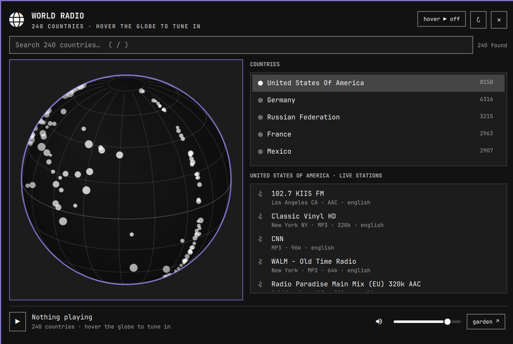

# World Radio

A spinning world globe for the Omarchy bar. Click for a big globe of
every country — hovering a country, city, or town plays live radio from
there.



## Install

```sh
omarchy plugin add https://github.com/kaibur02/omarchy-world-radio.git --enable
```

## Usage

Click the globe icon in the bar to open or close the world globe.
Press Escape to close it.

- Hover a globe dot, country row, or station row to tune in live radio
  from there (toggleable via the `hover ▶` button; when off, playback
  is click-only).
- Drag the globe to spin it by hand.
- Right-click the bar icon to stop playback, middle-click to open
  radio.garden in a browser.
- `/` focuses country search, `Space` toggles play/stop.

## Configure

```sh
omarchy bar move io.github.kaibur02.omarchy-world-radio --after omarchy.weather
omarchy bar set io.github.kaibur02.omarchy-world-radio hoverPlay false
```

## Remove

```sh
omarchy plugin remove io.github.kaibur02.omarchy-world-radio
```

## Details

- Station directory and streams via
  [radio-browser.info](https://www.radio-browser.info) (no API key needed).
- Coastlines from [Natural Earth](https://www.naturalearthdata.com)
  1:110m land (public domain), bundled in `Land.js`.
- Fully theme-reactive: every color comes from Omarchy's `Color`/`Style`
  singletons, so theme switches restyle the plugin live.
- No install hooks, no sudo, no background services. Runs entirely
  inside `omarchy-shell` as an unsandboxed QML plugin with standard user
  permissions.

## Files

| File            | What                          |
|-----------------|-------------------------------|
| `manifest.json` | Omarchy plugin manifest       |
| `Widget.qml`    | Bar widget + globe popup      |
| `Globe.qml`     | Canvas orthographic globe     |
| `Model.js`      | Country coordinates + API helpers |
| `Land.js`       | Coastline outlines (Natural Earth) |
| `preview.png`   | Marketplace preview screenshot |

## IPC

```sh
omarchy-shell io.github.kaibur02.omarchy-world-radio toggle   # open/close the globe
omarchy-shell io.github.kaibur02.omarchy-world-radio stop     # stop playback
omarchy-shell io.github.kaibur02.omarchy-world-radio status   # JSON state
```
